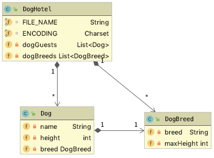

# Übung DogHotel

- Einlesen einer Textdatei
- Erstellen von Objekten

## Ausgangssituation

Für ein Hundehotel ist eine einfache Verwaltung der Hundegäste zu
erstellen. Im Hundehotel (DogHotel) sind mehrere Hunde (Dog)
untergebracht, die unterschiedlichen Hunderassen (DogBreed) angehören.

```
BREED;"Affenpinscher";30
BREED;"Havaneser";27
BREED;"Basenji";43
BREED;"Dobermann";72
DOG;"Arko";41;"Basenji"
BREED;"Rhodesian Ridgeback";69
DOG;"Tino";63;"Rhodesian Ridgeback"
DOG;"Bello";27;"Affenpinscher"
DOG;"Timmy";45;"Golden Retriever"
```

## Aufgabenstellung

- Erstellen Sie folgende Klassen:



- Für die Klassen `Dog` und `DogBreed` erstellen Sie die notwendigen Methoden. Speziell für die Klasse `DogHotel` sehen die Methoden wie folgt aus.

  

- Erweitern Sie diese Klassen so, dass die bereits existierenden
  Unittests funktionieren. 
  

  
  
Viel Erfolg!